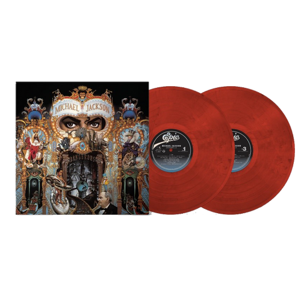
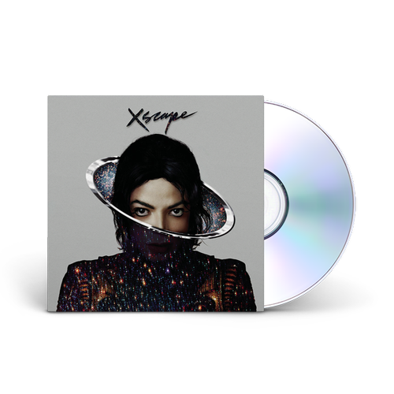
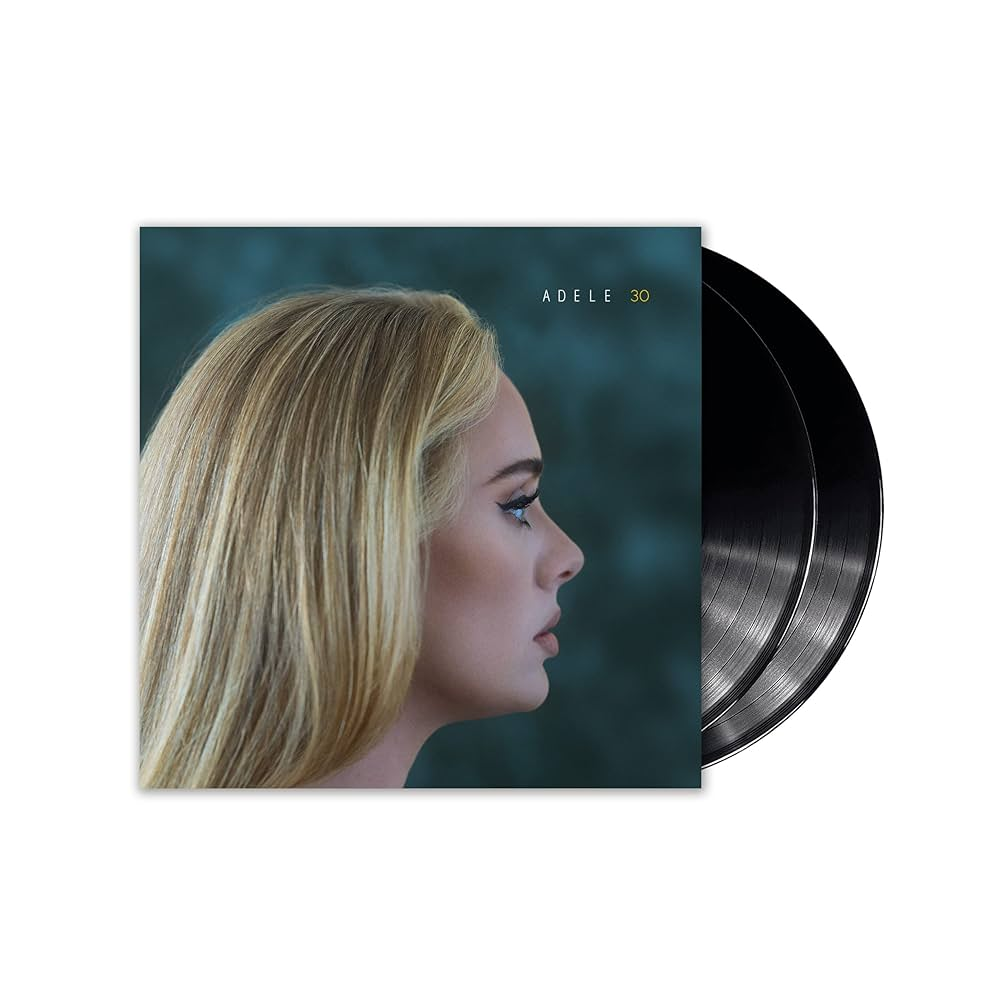

# Trabalho UC 15 – Desenvolver e organizar elementos estruturais de sites

## Loja de Discos de Vinil

### Introdução

Este documento fornece a documentação para o site Vinyl Disks. Ele detalha o código da página principal, descreve as funcionalidades implementadas e destaca as alterações realizadas. A loja oferece uma variedade de discos de vinil clássicos e modernos, com uma interface de usuário atraente e interativa.

---

## Códigos

### Código da página principal

A página principal foi desenvolvida utilizando HTML, CSS e JavaScript. O código a seguir apresenta a estrutura completa da página.

## Descrição
### HTML:
Contém toda a estrutura do site, incluindo o cabeçalho, navegação, seções de conteúdo e rodapé.
Seções: Home, Sobre, Loja, Contato.

### CSS:
Estilos internos para layout e design, usando cores vibrantes e sombras para destacar elementos.
Estilos responsivos para garantir que o site fique bem em dispositivos móveis e desktops.

### JavaScript:
Função para adicionar itens ao carrinho e atualizar o contador de itens no carrinho.
Função para enviar o formulário de contato com feedback ao usuário.

## Código Inicial

```html
<!DOCTYPE html>
<html lang="pt-BR">
<head>
    <meta charset="UTF-8">
    <meta name="viewport" content="width=device-width, initial-scale=1.0">
    <title>Loja de Vinil</title>
    <link rel="stylesheet" href="styles.css">
</head>
<body>
    <header>
        <h1>Loja de Discos de Vinil</h1>
        <nav>
            <ul>
                <li><a href="#home">Home</a></li>
                <li><a href="#about">Sobre</a></li>
                <li><a href="#store">Loja</a></li>
                <li><a href="#contact">Contato</a></li>
            </ul>
        </nav>
    </header>

    <main>
        <section id="home">
            <h2>Bem-vindo à nossa loja!</h2>
            <p>Explore nossa coleção de discos de vinil clássicos e modernos.</p>
        </section>

        <section id="about">
            <h2>Sobre Nós</h2>
            <p>Somos apaixonados por vinil e dedicados a trazer para você a melhor seleção de discos.</p>
        </section>

        <section id="store">
            <h2>Nossa Loja</h2>
            <div class="product">
                
                <h3>Disco de Vinil 1</h3>
                <p>Artista: Exemplo 1</p>
                <button onclick="addToCart('Disco de Vinil 1')">Adicionar ao Carrinho</button>
            </div>
            <div class="product">
                
                <h3>Disco de Vinil 2</h3>
                <p>Artista: Exemplo 2</p>
                <button onclick="addToCart('Disco de Vinil 2')">Adicionar ao Carrinho</button>
            </div>
            <!-- Adicione mais produtos conforme necessário -->
        </section>

        <section id="contact">
            <h2>Contato</h2>
            <form id="contact-form">
                <label for="name">Nome:</label>
                <input type="text" id="name" name="name" required>
                <label for="email">Email:</label>
                <input type="email" id="email" name="email" required>
                <label for="message">Mensagem:</label>
                <textarea id="message" name="message" required></textarea>
                <button type="submit">Enviar</button>
            </form>
        </section>
    </main>

    <footer>
        <p>&copy; 2024 Loja de Discos de Vinil. Todos os direitos reservados.</p>
    </footer>

    <script src="script.js"></script>
</body>
</html>
```

```css
body {
    font-family: Arial, sans-serif;
    margin: 0;
    padding: 0;
}

header {
    background-color: #333;
    color: white;
    padding: 1em 0;
    text-align: center;
}

nav ul {
    list-style: none;
    padding: 0;
}

nav ul li {
    display: inline;
    margin: 0 1em;
}

nav ul li a {
    color: white;
    text-decoration: none;
}

main {
    padding: 2em;
}

section {
    margin-bottom: 2em;
}

.product {
    border: 1px solid #ddd;
    padding: 1em;
    margin-bottom: 1em;
    text-align: center;
}

.product img {
    width: 100px;
    height: 100px;
}

footer {
    background-color: #333;
    color: white;
    text-align: center;
    padding: 1em 0;
    position: absolute;
    bottom: 0;
    width: 100%;
}
```

### Código Final

```html
<!DOCTYPE html>
<html lang="pt-BR">
<head>
    <meta charset="UTF-8">
    <meta name="viewport" content="width=device-width, initial-scale=1.0">
    <title>Loja de Vinil</title>
    <link rel="stylesheet" href="style.css">
    <style>
    </style>
</head>
<body>
    <header id="inicio">
        <div class="container">
            <div id="logo">
                
                <h1>Vinyl Disks</h1>

            </div>
            <nav>
                <ul>
                    <li><a href="#home">Home</a></li>
                    <li><a href="#about">Sobre</a></li>
                    <li><a href="#store">Loja</a></li>
                    <li><a href="#contact">Contato</a></li>
                </ul>
            </nav>
            <div class="cart">
                <span id="cart-count">0</span>
                
            </div>
        </div>
    </header>

    <main>
        <div class="banner">
            
            
        </div>

        <section id="home" class="section">
            <div class="container">
                <h2>Bem-vindo à nossa loja!</h2>
                <p>Explore nossa coleção de discos de vinil clássicos e modernos.</p>
            </div>
        </section>

        <section id="about" class="section">
            <div class="container">
                <h2>Sobre Nós</h2>
                <p>Somos apaixonados por vinil e dedicados a trazer para você a melhor seleção de discos.</p>
            </div>
        </section>

        <section id="store" class="section">
            <div class="container">
                <h2>Lançamentos</h2>
                <div class="products">
                    <div class="product">
                        
                        <h3>Dangerous</h3>
                        <p>Artista: Michael Jackson</p>
                        <p>Preço: R$ 99,90</p>
                        <button onclick="addToCart('Dangerous')">Adicionar ao Carrinho</button>
                    </div>
                    <div class="product">
                        
                        <h3>Xscape</h3>
                        <p>Artista: Michael Jackson</p>
                        <p>Preço: R$ 89,90</p>
                        <button onclick="addToCart('Xscape')">Adicionar ao Carrinho</button>
                    </div>
                    <!-- Adicione mais produtos conforme necessário -->
                </div>
            </div>
        </section>
        <section id="store" class="section">
            <div class="container">
                <h2>Mais Vendidos</h2>
                <div class="products">
                    <div class="product">
                        
                        <h3>ARTPOP</h3>
                        <p>Artista: Lady Gaga</p>
                        <p>Preço: R$ 79,90</p>
                        <button onclick="addToCart('ARTPOP')">Adicionar ao Carrinho</button>
                    </div>
                    <div class="product">
                        
                        <h3>30</h3>
                        <p>Artista: Adele</p>
                        <p>Preço: R$ 119,90</p>
                        <button onclick="addToCart('30')">Adicionar ao Carrinho</button>
                    </div>
                    <!-- Adicione mais produtos conforme necessário -->
                </div>
            </div>
        </section>

        <section id="contact" class="section">
            <div class="container">
                <h2>Contato</h2>
                <form id="contact-form">
                    <label for="name">Nome:</label>
                    <input type="text" id="name" name="name" required>
                    <label for="email">Email:</label>
                    <input type="email" id="email" name="email" required>
                    <label for="message">Mensagem:</label>
                    <textarea id="message" name="message" required></textarea>
                    <button type="submit">Enviar</button>
                </form>
            </div>
        </section>
    </main>

    <footer id="contato">
        <div class="social-media">
            <a href="#" target="_blank">Facebook</a>
            <a href="#" target="_blank">Instagram</a>
            <a href="#" target="_blank">Twitter</a>
            <a href="#" target="_blank">YouTube</a>
        </div>
        <p>&copy; 2024 RetroDiscos. Design By Christopher Domingos.</p>
    </footer>

    <script>
        let cartCount = 0;

        function addToCart(product) {
            cartCount++;
            document.getElementById('cart-count').textContent = cartCount;
            alert(product + ' foi adicionado ao carrinho!');
        }

        document.getElementById('contact-form').addEventListener('submit', function(event) {
            event.preventDefault();
            alert('Mensagem enviada com sucesso!');
        });
    </script>
</body>
</html>
```

```css
body {
    font-family: 'Arial', sans-serif;
    margin: 0;
    padding: 0;
    background-color: #f0f0f0;
}

header {
    background-color: #741a1d;
    color: white;
    padding: 1em 0;
}

#logo img {
    width: 100pxx;
    height: 100px;
}

header .container {
    display: flex;
    justify-content: space-between;
    align-items: center;
    max-width: 1200px;
    margin: 0 auto;
    padding: 0 1em;
}

header h1 {
    margin: 0;
}

header div h1 {
    margin-right: 400px; /* Movimenta o Titulo do Site */
}

nav ul {
    list-style: none;
    padding: 0;
    margin: 0;
    display: flex;
}

nav ul li {
    margin: 0 1em;
}

nav ul li a {
    color: white;
    text-decoration: none;
    font-weight: bold;
    transition: color 0.3s ease;
}

nav ul li a:hover {
    color: #ffd700;
}

.cart {
    display: flex;
    align-items: center;
}

.cart img {
    width: 24px;
    height: 24px;
}

#cart-count {
    background-color: #ffd700;
    color: #741a1d;
    border-radius: 50%;
    padding: 0.2em 0.6em;
    margin-right: 0.5em;
    font-weight: bold;
}

main {
    max-width: 1200px;
    margin: 2em auto;
    padding: 0 1em;
}

.section1 {
    background-color: white;
    margin-bottom: 2em;
    padding: 2em;
    box-shadow: 0 0 10px rgba(0, 0, 0, 0.1);
}

.banner img {
    width: 100%;
    height: 200px;
    object-fit: cover; /* imagem de fundo do banner */
    border-radius: 10px 10px 0 0; /* bordas arredondadas */
}

.section {
    background-color: white;
    margin-bottom: 2em;
    padding: 2em;
    box-shadow: 0 0 10px rgba(0, 0, 0, 0.1);
    border-left: 5px solid #741a1d;
}

.section h2 {
    color: #741a1d;
}

.products {
    display: flex;
    flex-wrap: wrap;
    gap: 2em;
}

.product {
    flex: 1 1 calc(33.333% - 2em);
    background-color: #fff;
    border: 1px solid #ddd;
    padding: 1em;
    text-align: center;
    box-shadow: 0 0 10px rgba(0, 0, 0, 0.1);
    transition: transform 0.3s ease, box-shadow 0.3s ease;
}

.product:hover {
    transform: translateY(-10px);
    box-shadow: 0 10px 20px rgba(0, 0, 0, 0.2);
}

.product img {
    width: 100%;
    height: auto;
}

.product h3 {
    color: #741a1d;
}

.product button {
    background-color: #741a1d;
    color: white;
    border: none;
    padding: 0.5em 1em;
    cursor: pointer;
    transition: background-color 0.3s ease;
}

.product button:hover {
    background-color: #741a1d;
}

footer {
    background-color: #333;
    color: white;
    text-align: center;
    padding: 1em 0;
}

footer .container {
    max-width: 1200px;
    margin: 0 auto;
    padding: 0 1em;
}

@media (max-width: 768px) {
    .product {
        flex: 1 1 calc(50% - 2em);
    }
}

@media (max-width: 480px) {
    nav ul {
        flex-direction: column;
    }
    nav ul li {
        margin: 0.5em 0;
    }
    .product {
        flex: 1 1 100%;
    }
}

footer {
    background-color: #333; /* background escuro para o rodapé */
}

footer div a {
    color: white;
    margin: 4px;
}
```

## JavaScript
```JavaScrípt
let cartCount = 0;

        function addToCart(product) {
            cartCount++;
            document.getElementById('cart-count').textContent = cartCount;
            alert(product + ' foi adicionado ao carrinho!');
        }

        document.getElementById('contact-form').addEventListener('submit', function(event) {
            event.preventDefault();
            alert('Mensagem enviada com sucesso!');
        });
```

